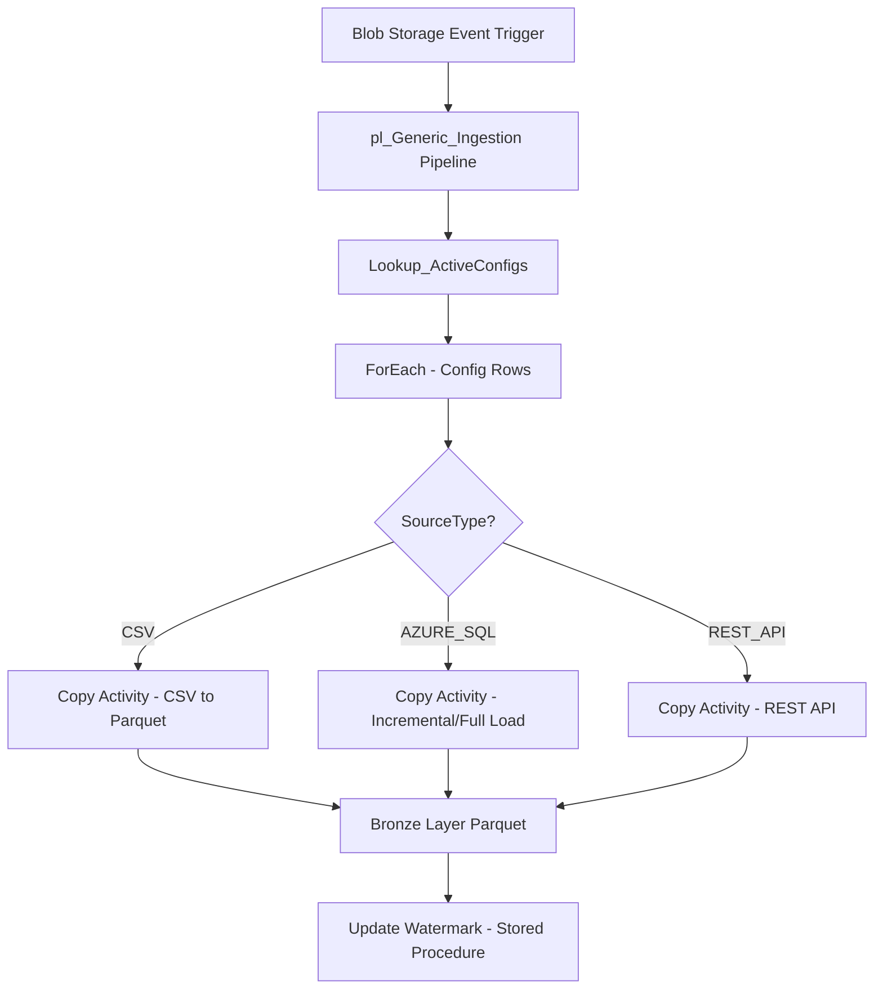

# Metadata-Driven Multi-Source Ingestion Pipeline in Azure Data Factory


A scalable, maintainable, and **event-driven** ingestion framework using Azure Data Factory (ADF) that supports multiple source types (CSV, REST API, Azure SQL) through a central configuration table.

## Project Overview

This solution implements a **metadata-driven ingestion pipeline** for CCBJI's centralized analytics platform.

Instead of building separate pipelines for each source, we use **one generic pipeline** that reads configuration from a SQL table and dynamically processes different sources.

### Key Features

- **Single Generic Pipeline** — Handles CSV, REST API, and Azure SQL
- **Event-Driven** for CSV files (Blob Storage trigger)
- **Support for Multiple Tables** per source (e.g., `sap/sales`, `sap/orders`)
- **Medallion Architecture Ready** — Bronze layer with proper partitioning
- **Incremental Load Support** for Azure SQL using watermark pattern
- **Config-Driven Onboarding** — Add new sources/tables by inserting just **one row**

## High-Level Architecture



### High-Level Flow:

- Event Trigger fires when a new CSV file lands
- Lookup reads active configurations from SQL table
- ForEach processes each config row
- If Conditions route to the appropriate Copy activity
- Data lands in Bronze layer with proper partitioning

### Folder Structure
```
ccm-datalake/
├── ingestion/                      # Landing / Raw zone
│   ├── sap/
│   │   └── sales/
│   │       └── sales_transactions_20260328.csv
│   ├── azure_sql/
│   │   └── customer/
│   └── rest_api/
│       └── product/
└── storage/                        # Bronze Layer (Parquet)
    ├── sap/
    │   └── sales/
    │       └── sales_20260328.parquet
    ├── azure_sql/
    │   └── customer/
    └── rest_api/
        └── product/
```

Configuration Table
```
CREATE TABLE dbo.IngestionConfig (
    ConfigId            INT IDENTITY(1,1) PRIMARY KEY,
    SourceSystem        VARCHAR(50)  NOT NULL,     -- 'sap', 'azure_sql', 'rest_api'
    TableName           VARCHAR(100) NOT NULL,
    SourceType          VARCHAR(20)  NOT NULL,     -- 'CSV', 'REST_API', 'AZURE_SQL'
    IsActive            BIT DEFAULT 1,

    LinkedServiceName   VARCHAR(100),
    SourceDatasetName   VARCHAR(100),
    SourceParams        NVARCHAR(MAX),            -- JSON for extra params

    WatermarkColumn     VARCHAR(100),
    WatermarkValue      DATETIME2(0) NULL,

    LastProcessedDate   DATE NULL,
    CreatedDate         DATETIME2 DEFAULT GETUTCDATE(),
    UpdatedDate         DATETIME2 DEFAULT GETUTCDATE()
);
```

Sample Data
```
ConfigId|SourceSystem|TableName|SourceType|IsActive|LinkedServiceName |SourceDatasetName  |SourceParams                |WatermarkColumn|WatermarkValue         |LastProcessedDate|CreatedDate            |UpdatedDate            |
--------+------------+---------+----------+--------+------------------+-------------------+----------------------------+---------------+-----------------------+-----------------+-----------------------+-----------------------+
       1|sap         |sales    |CSV       |       1|ls_ADLS_Landing   |ds_Generic_CSV     |{}                          |               |                       |                 |2026-03-28 12:39:06.240|2026-03-28 12:39:06.240|
       2|azure_sql   |customer |AZURE_SQL |       1|ls_AzureSQL_Source|ds_Generic_AzureSQL|{"tableName":"dbo.Customer"}|last_modified  |2026-03-26 22:12:59.000|       2026-03-31|2026-03-28 12:39:06.250|2026-03-31 17:46:43.786|
       3|rest_api    |product  |REST_API  |       1|ls_HTTP_ProductAPI|ds_Generic_HTTP    |{"relativeUrl":"/products"} |               |                       |                 |2026-03-28 12:39:06.253|2026-03-28 12:39:06.253|

```

Pipeline Design (pl_Generic_Ingestion)

The pipeline consists of:

- Lookup → Reads active configurations
- ForEach → Loops through each config
- If Condition → Routes based on SourceType
- Copy Activity → Performs actual data movement
- Stored Procedure → Updates watermark for SQL sources

## Databricks Transformation and Silver Layer

Once data lands in the storage/bronze layer from ADF, an Azure Databricks config-driven transformation pipeline processes it into the Silver layer.

- Configuration-based pipeline in Databricks
- First run loads data as a full load
- Subsequent runs perform incremental loads
- Silver layer maintains processing history

Silver schemas:
- `scmdatalake_silver_sap`
- `scmdatalake_silver_rest_api`
- `scmdatalake_silver_azure_sql`

Azure Workflows for Silver load:
- `azure_sql_silver_data_load_wf`
- `sap_silver_data_load_wf`

Setup Instructions

Create required Linked Services (ls_ADLS_Landing, ls_ADLS_Bronze, ls_AzureSQL_Source, etc.)
Create Datasets (ds_Generic_CSV, ds_Generic_HTTP, ds_Generic_AzureSQL, ds_Bronze_Parquet)
Create the IngestionConfig table and insert sample rows
Deploy the pipeline pl_Generic_Ingestion
Create Blob Storage Event Trigger and map triggerFileName
