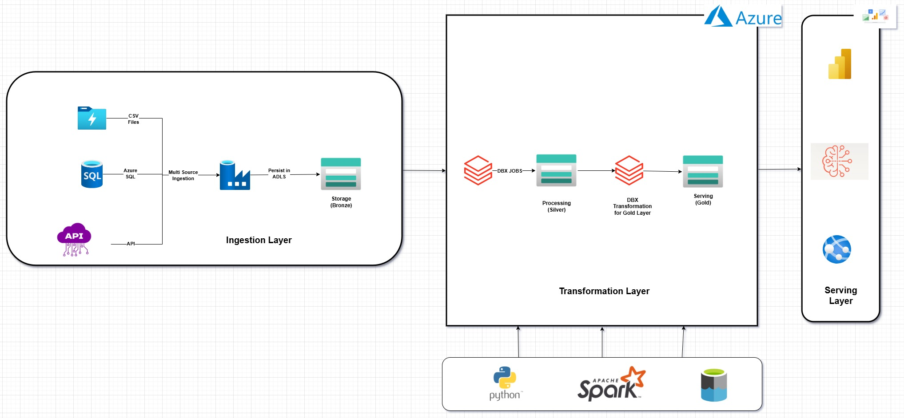
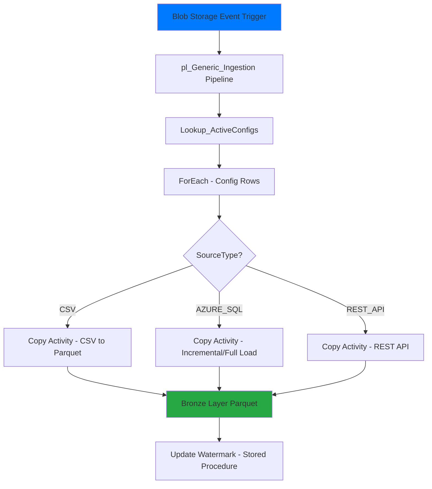
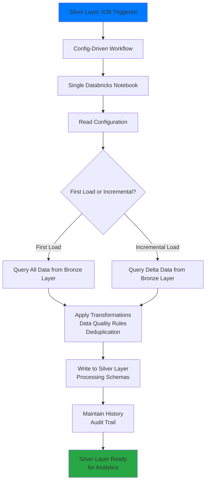

# Supply Chain ETL Pipeline — Medallion Architecture


A **highly scalable, maintainable, and enterprise-grade** ETL framework that ingests from multiple sources into Bronze (storage), then transforms into Silver (processing) using Databricks. Built on proven industry best practices and medallion architecture principles.

## High-Level Architecture



## Project Overview

This solution implements a **two-stage metadata-driven pipeline** for a supply chain analytics platform:

1. **INGESTION (ADF)** — Multi-source data collection into Bronze layer
2. **TRANSFORMATION (Databricks)** — Config-driven data processing into Silver layer and Gold Layer

Instead of building separate pipelines for each source and transformation, we use **generic, config-driven pipelines** that read configurations from SQL tables and dynamically process unlimited sources and transformations—eliminating technical debt and enabling rapid scaling.


### Key Features

**Ingestion (ADF)**
- **Single Generic Pipeline** — Handles CSV, REST API, and Azure SQL
- **Event-Driven** for CSV files (Blob Storage trigger)
- **Support for Multiple Tables** per source (e.g., `sap/sales`, `sap/orders`)
- **Medallion Architecture Bronze Layer** — Parquet format with proper partitioning
- **Incremental Load Support** for Azure SQL using watermark pattern
- **Config-Driven Onboarding** — Add new sources/tables by inserting one row

**Transformation (Databricks)**
- **Config-Based Transformation Pipeline** — Dynamic processing based on configurations
- **Full Load on First Run** — Initial historical data load
- **Incremental Load Support** — Subsequent runs for changed data only
- **Silver Layer History** — Maintains processing history and transformations
- **Multi-Source Schemas** — SAP, REST API, and Azure SQL transformations

## ADF LLD Flow Diagram



---

## PART 1: INGESTION (Azure Data Factory)

### Configuration-Driven Pipeline (Highly Maintainable & Scalable)

The ADF ingestion pipeline is **highly configurable and metadata-driven**. Instead of deploying new pipelines for each table or source, all configurations are centralized in a SQL table. The generic pipeline reads from this configuration and dynamically processes any source.

**Key Benefit:** Onboard a new table by inserting **just ONE row** into the configuration table—no code changes, no pipeline redeploy, zero downtime. This is a **hallmark of scalable, enterprise-grade data platforms**.

**Scalability Impact:**
- Day 1: 3 tables configured
- Month 1: 50 tables onboarded with zero pipeline changes
- Year 1: 500 tables managed by the same generic pipeline
- All achieved without modifying, testing, or redeploying the pipeline code


```
ccm-datalake/
├── ingestion/                      # Landing / Raw zone
│   ├── sap/
│   │   └── sales/
│   │       └── sales_transactions_20260328.csv
│   ├── azure_sql/
│   │   └── customer/
│   └── rest_api/
│       └── product/
└── storage/                        # Bronze Layer (Parquet)
    ├── sap/
    │   └── sales/
    │       └── sales_20260328.parquet
    ├── azure_sql/
    │   └── customer/
    └── rest_api/
        └── product/
```

### Ingestion Configuration Table (ADF)

```
ConfigId|SourceSystem|TableName|SourceType|IsActive|LinkedServiceName |SourceDatasetName  |SourceParams                |WatermarkColumn|WatermarkValue         |LastProcessedDate|
--------+------------+---------+----------+--------+------------------+-------------------+----------------------------+---------------+-----------------------+-----------------+
       1|sap         |sales    |CSV       |       1|ls_ADLS_Landing   |ds_Generic_CSV     |{}                          |               |                       |
       2|azure_sql   |customer |AZURE_SQL |       1|ls_AzureSQL_Source|ds_Generic_AzureSQL|{"tableName":"dbo.Customer"}|last_modified  |2026-03-26 22:12:59.000|
       3|rest_api    |product  |REST_API  |       1|ls_HTTP_ProductAPI|ds_Generic_HTTP    |{"relativeUrl":"/products"} |               |                       |
```

### Ingestion Pipeline Design (pl_Generic_Ingestion)

**Flow:**
1. **Trigger** — Blob Storage event fires when CSV lands
2. **Lookup** — Reads active configurations from IngestionConfig table
3. **ForEach** — Iterates through each config row
4. **If Condition** — Routes based on SourceType (CSV, AZURE_SQL, REST_API)
5. **Copy Activity** — Transfers data to Bronze layer in Parquet format
6. **Stored Procedure** — Updates watermark for SQL and REST API sources

**Output:** Bronze layer storage (ccm-datalake/storage/)

This is a **single generic pipeline** that handles unlimited source tables. The same `pl_Generic_Ingestion` pipeline processes table #1, table #2, table #100—all configured through the IngestionConfig table.

### Onboarding a New Table (Single-Row Configuration)

To add a new table to ingestion, insert ONE row into `IngestionConfig`:

```sql
INSERT INTO dbo.IngestionConfig 
(SourceSystem, TableName, SourceType, LinkedServiceName, SourceDatasetName, SourceParams, WatermarkColumn, IsActive)
VALUES 
('sap', 'orders', 'CSV', 'ls_ADLS_Landing', 'ds_Generic_CSV', '{}', NULL, 1);
```

That's it. The `pl_Generic_Ingestion` pipeline automatically picks up this new configuration on the next run and starts ingesting the `sap.orders` table. 

**No pipeline changes, no re-deployment, no downtime.**

---

## PART 2: TRANSFORMATION (Azure Databricks)


Once data lands in the Bronze layer, Databricks processes it into the Silver layer for analytics—following medallion architecture principles.

### Transformation Pipeline Behavior

- **First Run** — Full historical load into Silver layer
- **Subsequent Runs** — Incremental load of changed/new data only via watermark patterns
- **History Tracking** — Silver layer maintains complete processing history (audit trail)
- **Config-Based** — Transformations defined in configuration, not hard-coded
- **Scalable Design** — Same workflow handles 1 table or 1000 tables through configuration

### Silver Layer Schemas (Processing Layer)

- `scmdatalake_silver_sap` — SAP data transformations with quality rules and history
- `scmdatalake_silver_rest_api` — REST API data transformations with quality rules and history
- `scmdatalake_silver_azure_sql` — Azure SQL data transformations with quality rules and history

### Databricks Transformation Flow Diagram



### Azure Workflows for Silver Load

- `azure_sql_silver_data_load_wf` — Orchestrates Azure SQL → Silver layer transformation
- `sap_silver_data_load_wf` — Orchestrates SAP → Silver layer transformation

---

### Architecture Principles

**Medallion Architecture**
- **Bronze Layer** — Raw data ingestion with no transformations (immutable source of truth)
- **Silver Layer** — Data quality, deduplication, and history tracking
- **Gold Layer** — Business-ready aggregated data for analytics and reporting

**Scalability**
- Config-table-driven design enables horizontal scaling—add new sources/tables without code changes
- Generic pipelines handle unlimited data sources and volumes
- Event-driven triggers for near-real-time processing

**Maintainability**
- **Single source of truth** via IngestionConfig table
- No technical debt from pipeline duplication
- Easy onboarding: insert one row to add a new table
- Clear separation of concerns (Ingestion vs. Transformation)

**Industry Best Practices**
- Metadata-driven architecture for flexibility and governance
- Incremental load patterns to optimize performance and costs
- Watermark-based change tracking for reliable incremental processing
- Full audit trails and history tracking in Silver layer
- Parquet format for optimal compression and query performance

---

## Setup Instructions

### Part 1: Ingestion (ADF)

1. Create required Linked Services
   - `ls_ADLS_Landing` — Azure Data Lake Storage (landing zone)
   - `ls_ADLS_Bronze` — Azure Data Lake Storage (bronze layer)
   - `ls_AzureSQL_Source` — Azure SQL source systems
   - `ls_HTTP_ProductAPI` — REST API sources

2. Create Datasets
   - `ds_Generic_CSV` — Generic CSV dataset template
   - `ds_Generic_HTTP` — Generic HTTP dataset template
   - `ds_Generic_AzureSQL` — Generic Azure SQL dataset template
   - `ds_Bronze_Parquet` — Parquet output dataset

3. Create the IngestionConfig table and insert sample rows

4. Deploy the ADF pipeline `pl_Generic_Ingestion`

5. Create Blob Storage Event Trigger and map triggerFileName parameter

### Part 2: Transformation (Databricks)

1. Create Databricks workspace and cluster

2. Configure transformation notebooks for each source system

3. Deploy Databricks workflows
   - `azure_sql_silver_data_load_wf`
   - `sap_silver_data_load_wf`

4. Create Silver layer database schemas
   - `scmdatalake_silver_sap`
   - `scmdatalake_silver_rest_api`
   - `scmdatalake_silver_azure_sql`
